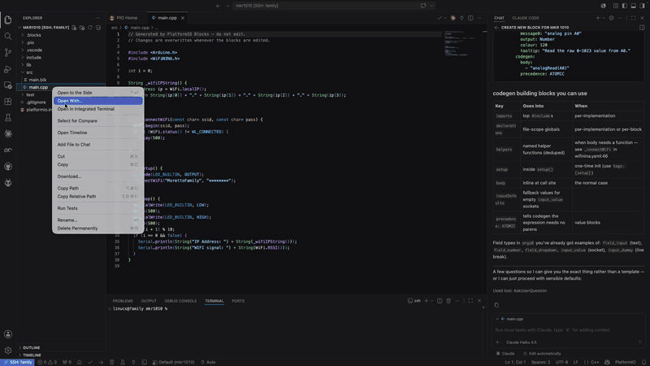

# Maker Block Studio for VS Code

**Build programs for Arduino by dragging colorful blocks — like Scratch, but it writes real code for you.**

No syntax to memorize. No semicolons to forget. You snap blocks together, and Maker Block Studio turns them into working C++ that compiles and uploads to your board.



> **New to coding?** That's exactly who this is for. If you can drag and drop, you can build a program.

## Why you'll like it

- 🧩 **Drag-and-drop, not typing** — pick blocks from a menu and connect them. The hard part (the code) is handled automatically.
- 👀 **See it work instantly** — every time you change a block, the program updates live.
- 🔌 **Knows your board** — it reads your project and shows only the blocks that make sense for the hardware you're using.
- 📦 **Installs libraries for you** — use a block that needs an extra library? It gets added to your project automatically. You don't have to hunt for it.
- 📖 **One click to the docs** — a button in the toolbar opens the reference documentation for the parts you're actually using.
- 💾 **Saves your work automatically** — nothing to remember, nothing to lose.

## Getting started

### What you need first

Maker Block Studio sits on top of one of two free tools that actually build and upload your code to the board. You need **one** of them:

- **[PlatformIO](https://platformio.org/install/ide?install=vscode)** — a popular extension for VS Code. (Easiest if you're already in VS Code.)
- **[Arduino CLI](https://arduino.github.io/arduino-cli/)** — or the Arduino IDE 2.x, which uses it under the hood. Pair it with the sister extension **[Arduino CLI IDE](https://marketplace.visualstudio.com/items?itemName=linucs.vscode-arduino-cli-ide)** to get Compile and Upload buttons right inside VS Code.

You also need a **project folder** that tells the tools which board you have. The editor recognizes three kinds of project, by the config file in the folder:

- **PlatformIO** (`platformio.ini`) or **Arduino CLI / Arduino IDE** (`sketch.yaml`) — your blocks generate **C++** (`.cpp` / `.ino`).
- **Arduino App Lab** (`app.yaml`) — a Python-based app (`python/main.py`); here your blocks generate **Python** instead.

If you're using PlatformIO, the Arduino IDE, or App Lab, creating a new project sets this up for you automatically.

> **Don't have a project yet?** In VS Code, install PlatformIO, click the 🐜 ant icon in the sidebar → **New Project**, pick your board, and you're ready.

### Build your first program

1. Install this extension (plus PlatformIO or the Arduino CLI).
2. Open your project folder in VS Code.
3. In the file explorer, **right-click** your main source file (it ends in `.cpp`, `.ino`, or `.py`).
4. Choose **"Open in Maker Block Studio"**. (The classic **"Open With…"** → **"Maker Block Studio"** route still works too.)
5. Drag blocks from the menu on the left and click them together to build your program.
6. Build and upload to your board the way you normally would — the code is already written for you.

That's it. The code file updates itself every time you move a block.

### The toolbar

Along the top of the editor you'll find:

- **Generate code** — a split button that writes the code on demand, with a **"Generate automatically on change"** toggle so you can choose live updates or manual ones (the same as the `blocks-editor.generateOnChange` setting).
- **Open reference documentation** — opens the docs for the components used by the blocks currently on the canvas.

## Frequently asked questions

**Do I need to know how to program?**
No. That's the whole point. The blocks describe what you want to happen, and the extension writes the code.

**Will it break my project or delete my files?**
No. It only ever *adds* the libraries your blocks need — it never removes anything you set up. Your block layout is saved safely in its own file.

**The code file says "do not edit" — why?**
Because the blocks are in charge. The code file is generated from your blocks, so if you edited it by hand, your changes would be replaced the next time you move a block. Edit the blocks, not the code.

**What gets saved where?**
Two files sit next to each other, e.g. `main.cpp` and `main.blk`:

```
🧩 Your blocks  ─────►  main.cpp   the code (written for you — don't edit by hand)
                ─────►  main.blk   your block layout (this is your real work)
```

If you use version control (like Git), commit **both** files.

**Where does setup-once code go?**
Most blocks run over and over (that's the `loop`). For things that should happen **once at startup** (like turning on the serial monitor), there's a special **"setup"** container block — drop those blocks inside it.

## What's included

- **Arduino building blocks** — Digital pins, Analog pins, Serial monitor, SPI, I2C (Wire), Math, Text, Time, Interrupts, and more.
- **Classic blocks** — Logic (if/else and switch/case), Loops, Math, Text, Variables, Lists, and Functions — always available.
- **Handy extras** — a search box to find blocks fast, an optional minimap for big programs, and customizable category colors.

## Settings

You can leave everything at its defaults. If you want to tweak things, open VS Code Settings and search for "Maker Block Studio":

| Setting | Default | What it does |
|---------|---------|--------------|
| `blocks-editor.generateOnChange` | `true` | Update the code automatically as you build. Turn off if you'd rather press the **Generate code** button yourself. (Also toggleable from the editor toolbar.) |
| `blocks-editor.showMinimap` | `false` | Show a small overview map of your blocks in the corner — handy for large programs. |
| `blocks-editor.catalogPaths` | `[]` | Add extra blocks from a folder or a web link (see below). |

## Requirements

- **VS Code 1.120 or newer**
- One supported project type:
  - **PlatformIO** — a `platformio.ini` with at least one `[env:...]` that sets a `board` and `framework = arduino`. → generates C++.
  - **Arduino CLI** — a `sketch.yaml` with at least one profile defining an FQBN-based board. → generates C++.
  - **Arduino App Lab** — an `app.yaml` app (with `python/main.py` and a `sketch/sketch.yaml` for the board). → generates Python.

## Good to know

- Right now Maker Block Studio supports the **Arduino** framework with **C++** (PlatformIO / Arduino CLI) and **Python** (Arduino App Lab). Other frameworks (ESP-IDF, STM32Cube, Micropython, …) aren't supported yet.
- The PlatformIO project reader doesn't yet understand advanced `platformio.ini` features (`extends`, `${...}` variables, file includes).
- Don't hand-edit the generated source file — your block layout is the real source, and edits to the code will be overwritten.

---

## For block authors: creating your own blocks

> This section is for people who want to **add new blocks** (for a specific sensor, board, or library). If you just want to *use* the editor, you can stop reading here.

Blocks are defined in **catalog files** — YAML stored in your project's `.blocks/` folder and validated against a JSON Schema. There are **three ways** to create one, from easiest to most hands-on:

1. **The visual Catalog Editor** — snap blocks together to design a catalog, no YAML to learn. *(New in 0.4.0 — start here.)*
2. **The Block Author AI assistant** — describe a library in plain language and let Copilot or Claude Code write the catalog for you.
3. **By hand** — write the YAML yourself, using the reference below.

All three produce the same kind of `.blocks/*.yaml` catalog, and all three can be [shared with the community](#-share-your-blocks-with-the-community) the same way.

### Author blocks visually (Catalog Editor)

The fastest way to make a block is to draw it. The **Catalog Editor** is a visual editor — just like the Maker Block Studio itself, but for *building* blocks instead of using them.

**Open it:**

- **New catalog:** create a file under a `.blocks/` folder in your project (e.g. `.blocks/my-sensor.yaml`) and open it — catalog files open in the Catalog Editor by default.
- **Existing catalog:** in the **Community Catalog** activity-bar view, expand **Installed Blocks**, right-click a catalog, and choose **"Edit catalog"**.

**Build the catalog** by dragging meta-blocks from the toolbox and snapping them together: the catalog holds *entries*, each entry holds an *implementation* (its runtime, dependencies, and shared code sections), and each implementation holds the *blocks* you're defining — their label, inputs, fields, and the code each one generates. The connection rules only let pieces fit where the schema allows, so you **can't build an invalid catalog by accident**. Mistakes and missing pieces are flagged inline and in a summary panel as you go.

Your work is saved straight back to the YAML file (the real source of truth) — with normal **save**, **undo**, and dirty-dot behavior. If a catalog uses something the visual surface can't represent yet (a custom imperative `generator:`, a Blockly mutator, or several documents in one file), the editor steps aside and opens the file as plain text instead.

For the full technical reference behind what the editor builds (every key, every section, every design decision), see [BLOCK_AUTHORING.md](BLOCK_AUTHORING.md). A minimal catalog — the YAML the editor reads and writes — looks like this:

```yaml
id: my-sensor
category: "Sensors"
implementations:
  - runtime: "arduino:cpp"
    dependencies:
      - type: library
        name: "MySensorLib"
        minVersion: "1.0.0"
    codegen:
      imports:
        - "#include <MySensor.h>"
      declarations:
        - "MySensor mySensor;"
    blocks:
      - blockly:
          type: my_sensor_begin
          message0:
            en: "start sensor on pin %1"
            it: "avvia sensore su pin %1"
          args0:
            - type: input_value
              name: PIN
              check: Number
          previousStatement: null
          nextStatement: null
          tooltip:
            en: "Initialize the sensor. Place inside a setup block."
            it: "Inizializza il sensore. Metti dentro un blocco setup."
        codegen:
          body:
            - "mySensor.begin({{PIN}});"
          inputDefaults:
            PIN: "2"
      - blockly:
          type: my_sensor_read
          message0:
            en: "read sensor"
            it: "leggi sensore"
          args0: []
          output: Number
          tooltip:
            en: "Read a value from the sensor."
            it: "Leggi un valore dal sensore."
        codegen:
          body:
            - "mySensor.read()"
          precedence: ATOMIC
```

The `message0` and `tooltip` fields support translations — use an object with language keys (`en`, `it`, …) instead of a plain string. English (`en`) is always required; other languages are optional.

### Loading custom catalogs

Add directories or URLs to the `blocks-editor.catalogPaths` setting:

```json
{
  "blocks-editor.catalogPaths": [
    "./my-catalogs",
    "https://example.com/catalogs/my-sensor.yaml"
  ]
}
```

Run the command **"Maker Block Studio: Refresh Remote Catalogs"** to re-download remote catalogs after they change upstream.

### Catalog key concepts

- **`runtime`** — catalogs are filtered by the active framework and language (e.g. `arduino:cpp`). Blocks for a different runtime are hidden automatically.
- **`dependencies`** — libraries merged into the project config when any block from this implementation is used. They become `lib_deps` in `platformio.ini`, or `libraries` in `sketch.yaml`. (Build flags are intentionally not block metadata — they're a project-setup concern.)
- **`category`** — supports `::` nesting for sub-categories (e.g. `"Input / Output::Digital"`).
- **`codegen`** sections — `body` (inline expression or statement), `imports`, `declarations`, `setup`, `helpers` (standalone functions). Use `{{FIELD_NAME}}` placeholders to reference block field values.
- **`inputDefaults`** — fallback values for unconnected inputs, so blocks are valid even before the user attaches a value.

### Block Author assistant

Don't want to write YAML by hand? Let an AI assistant research a hardware library and generate a complete, validated block catalog for you. The extension ships a **block-author** skill that works with both **GitHub Copilot** and **Claude Code** — one command sets up both.

#### Set it up

Run this once per project from the Command Palette:

**"Maker Block Studio: Set Up AI Assistants (Copilot & Claude Code)"**

It writes three things into your workspace:

- **`.mcp.json`** — registers this extension's MCP server so [Claude Code](https://claude.ai/code) can reach the catalog tools. In a Claude Code session, run `/mcp` and approve the **`blocks-editor`** server.
- **`.claude/skills/block-author/`** — the block-author skill (Claude Code discovers it automatically).
- **`.github/instructions/block-author.instructions.md`** — the same skill, in the form GitHub Copilot reads, so Copilot follows the identical workflow.

> Re-run the command after upgrading the extension to refresh the server path and skill files.

#### Use it

In either assistant, just ask in plain language:

```
create blocks for the Adafruit NeoPixel library
```

The assistant follows the same workflow in both hosts:

1. **Research** the library — fetch the real header files and documentation, check the PlatformIO and Arduino registries.
2. **Design** the blocks — propose a plan showing which blocks to create, which methods to expose, and which boards are supported.
3. **Generate** the YAML — write a validated catalog file and save it under your project's `.blocks/` folder.

### 🌟 Share your blocks with the community

**Authored some blocks? Please contribute them back.** Every catalog you share means another sensor, board, or library that the next person can just drag in — no YAML required. Community catalogs are what make visual programming reach more hardware and more people, so this is the single most valuable thing you can do for the project.

It takes one step — no git, no manual fork:

1. Right-click your catalog file under `.blocks/` (or run **"Maker Block Studio: Contribute Catalog to Community…"** from the Command Palette).
2. The extension **validates it locally**, then asks how you'd like to submit:
   - **Open a Pull Request** — uses your GitHub account and forks the community repo automatically.
   - **Submit via Issue** — opens a pre-filled form in your browser; no fork or git needed.
3. That's it — your catalog is on its way to the [community catalog](https://github.com/linucs/blocks-community-catalog).

By default, submissions go to the official [`linucs/blocks-community-catalog`](https://github.com/linucs/blocks-community-catalog) repo. Point them somewhere else (a fork or a private team repo) with the `blocks-editor.contributionRepo` setting (`owner/repo`).

## Version Control

Commit both the `.blk` files and the generated source files (`.cpp` / `.ino` / `.py`). The `.blk` is the authoritative source; the generated code lets collaborators (and CI) compile without the extension installed. Add the `.blocks/` folder (remote-catalog cache) to `.gitignore`.

## Community

Questions, ideas, or just want to show what you built? Join the [GitHub Discussions](https://github.com/linucs/vscode-blockly/discussions). And if you've authored blocks, [contribute your catalog](#-share-your-blocks-with-the-community) so others can use them too.

## Contributing

Contributions are welcome. See the [repository](https://github.com/linucs/vscode-blockly) for build instructions and development setup.

## License

[MIT](LICENSE)
